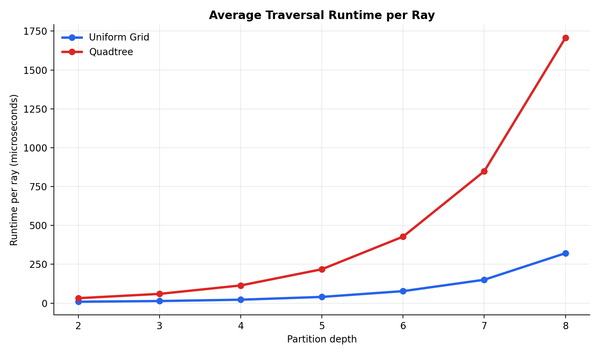
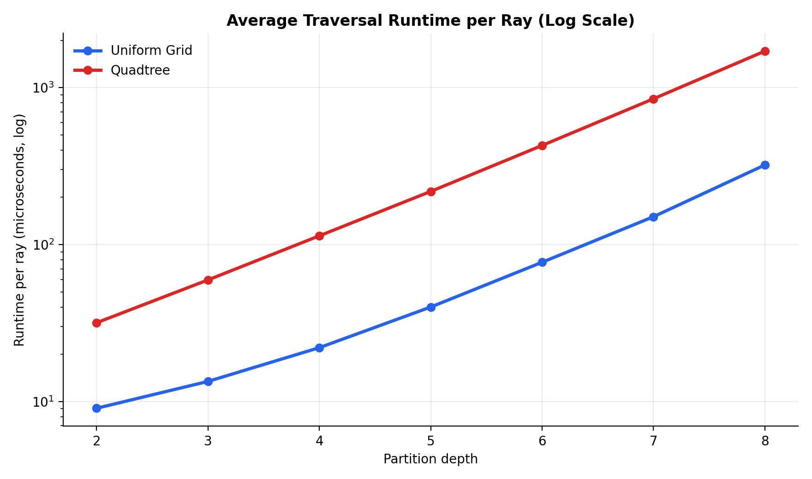
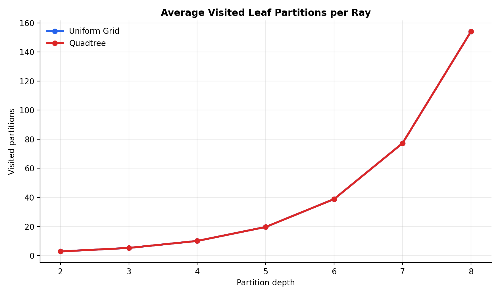
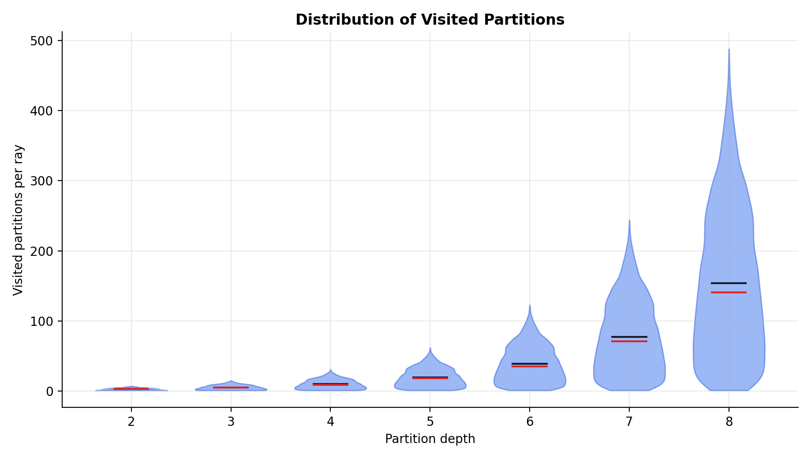
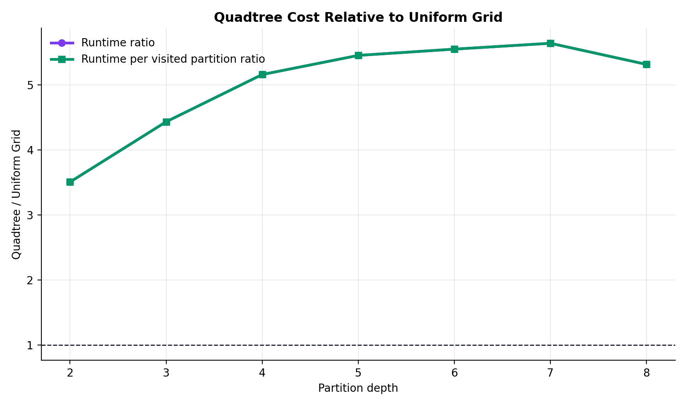
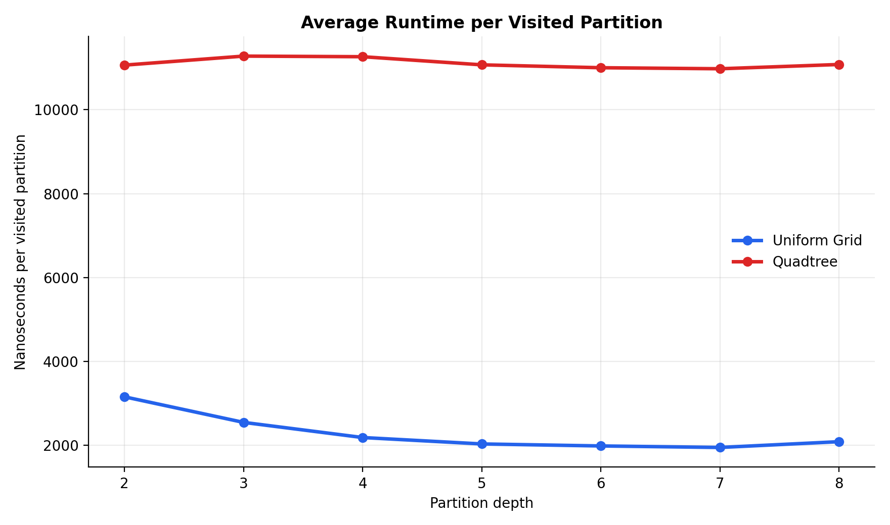
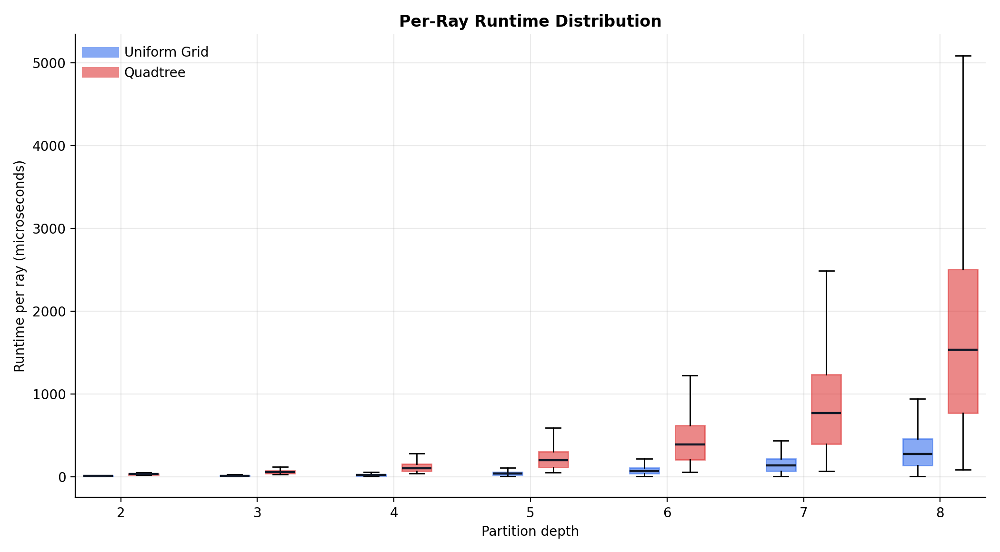
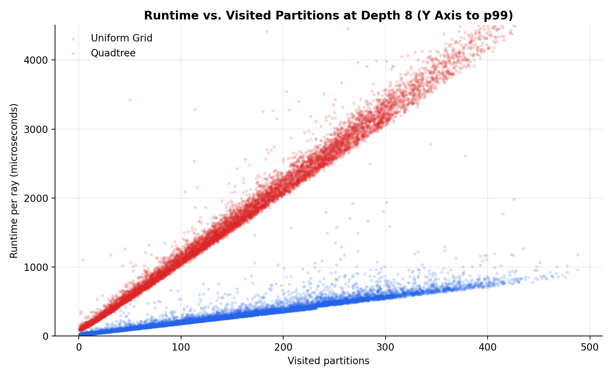

# Ray Traversal Benchmark Analysis

## Headline Result

For this complete-tree, same-depth experiment, the uniform grid and quadtree visited exactly the same leaf partitions for every generated ray at every tested depth. That is the most important validity check: the benchmark is comparing traversal cost for equivalent broad-phase partition visits, not different query results.

Under these conditions, the uniform grid traversal was consistently faster. The quadtree was about 3.5x slower at depth 2 and about 5.3x to 5.6x slower from depths 5 through 8.

This benchmark measures only the broad-phase traversal cost of determining which spatial partitions are visited by a ray. It does not measure object-level ray intersections or collision detection narrow phase.

## Experiment Configuration

- Rays: 10,000
- Depths: 2, 3, 4, 5, 6, 7, 8
- Seed: 42
- World bounds: square unit scene bounds
- Algorithms: `uniform_grid`, `quadtree`
- Comparison mode: same partition depth
- Raw rows: 140,000 per-ray measurements

The benchmark command was:

```bash
.venv/bin/python main.py --rays 10000 --depths 2,3,4,5,6,7,8 --seed 42 --out analysis_results/ray_traversal_20260606_201240/data
```

The analysis command was:

```bash
.venv/bin/python analysis_results/ray_traversal_20260606_201240/analyze_benchmark.py
```

## Main Summary Table

| Depth | Cells/Axis | Avg Visited | Grid ns/Ray | Quadtree ns/Ray | QT/Grid Runtime |
| --- | --- | --- | --- | --- | --- |
| 2 | 4 | 2.87 | 9,055 | 31,760 | 3.51 |
| 3 | 8 | 5.28 | 13,426 | 59,515 | 4.43 |
| 4 | 16 | 10.09 | 22,033 | 113,674 | 5.16 |
| 5 | 32 | 19.69 | 39,976 | 217,993 | 5.45 |
| 6 | 64 | 38.88 | 77,092 | 427,825 | 5.55 |
| 7 | 128 | 77.27 | 150,416 | 848,268 | 5.64 |
| 8 | 256 | 154.03 | 321,107 | 1,706,752 | 5.32 |

Full table files:

- [tables/summary_enriched.csv](tables/summary_enriched.csv)
- [tables/summary_enriched.md](tables/summary_enriched.md)
- [tables/runtime_distribution_percentiles.csv](tables/runtime_distribution_percentiles.csv)

## Agreement Check

| Depth | Rays | Count Mismatches | Checksum Mismatches | Median Extra QT ns |
| --- | --- | --- | --- | --- |
| 2 | 10000 | 0 | 0 | 21,208 |
| 3 | 10000 | 0 | 0 | 41,832 |
| 4 | 10000 | 0 | 0 | 84,479 |
| 5 | 10000 | 0 | 0 | 161,124 |
| 6 | 10000 | 0 | 0 | 318,396 |
| 7 | 10000 | 0 | 0 | 637,146 |
| 8 | 10000 | 0 | 0 | 1,256,792 |

There were zero visited-count mismatches and zero checksum mismatches. In other words, for the generated non-boundary rays, both methods traversed the same leaf partition sequence at each shared depth.

## Figures

### Average Runtime



The absolute runtime gap grows with depth. Both methods get more expensive because the ray crosses more partitions as resolution increases, but the quadtree pays a larger constant overhead.



On a log scale, the two curves have a similar shape. This supports the interpretation that both are scaling primarily with the number of visited leaf partitions, while the quadtree carries a higher constant factor.

### Visited Partitions



The average visited partition count is identical for both algorithms by construction and validation. It grows from 2.87 at depth 2 to 154.03 at depth 8.



The distribution widens strongly at deeper partition depths. Some rays leave the square quickly, while longer diagonal-ish paths visit hundreds of partitions.

### Relative Cost



The quadtree/grid runtime ratio rises through depth 7 and remains above 5x for the deeper cases. Runtime per visited partition shows the same pattern.



The grid amortizes setup overhead as rays visit more cells, settling near roughly 2,000 ns per visited partition at deeper depths. The quadtree stays near roughly 11,000 ns per visited partition across most depths.

### Per-Ray Distribution



The per-ray distributions show that the quadtree is not just slower on average; its whole runtime distribution is shifted upward.



At depth 8, runtime is approximately linear in visited partition count for both algorithms. The y-axis is clipped at the 99th percentile to make the main trend readable; the raw CSV still contains all outliers.

## Interpretation

The data supports a simple conclusion for this exact experiment: when the quadtree is complete and has the same leaf resolution as the uniform grid, it does not reduce the number of visited leaf partitions for broad-phase ray traversal. It therefore cannot win by visiting fewer partitions in this setup.

The uniform grid can walk directly from one cell to the next using incremental wall-crossing times. The complete quadtree traversal instead performs repeated AABB intersection tests while descending through internal nodes. Since both methods ultimately report the same leaf partitions, that internal traversal overhead appears as a clear constant-factor penalty.

The stronger statement is not "uniform grids are always better." The defensible statement is narrower:

For uniformly bounded, complete, same-depth 2D broad-phase ray partition traversal with generated non-boundary rays, this uniform-grid implementation is substantially faster than this complete-quadtree implementation while producing identical visited partition results.

## Limitations

This analysis does not cover adaptive quadtrees. An adaptive tree could visit fewer leaves in sparse or non-uniform scenes, which is a different experiment.

This analysis does not include object assignment costs, object-level intersection tests, or narrow phase. Those costs could change an end-to-end collision-detection result.

The benchmark uses generated rays that avoid pathological boundary cases and near-axis-parallel directions. That choice matches the intended scope: measuring ordinary traversal behavior rather than tie-breaking rules.

Python timing includes interpreter overhead and some system noise. The relative trend is still strong because each depth uses 10,000 identical rays per algorithm and the agreement checks confirm equal traversal results.

## Conclusion

For Modus A, same partition depth, the uniform grid is the clearer winner in this benchmark. It gives the same broad-phase partition visitation result as the complete quadtree, but with much lower traversal time. The measured advantage is already 3.5x at depth 2 and stabilizes around 5x or more at higher depths.

For the paper, I would present this as evidence that a complete quadtree is not automatically advantageous for ray shooting when it is forced to the same spatial resolution as a uniform grid. The quadtree's hierarchy adds traversal overhead, and without adaptivity or object-level pruning benefits, that overhead is not compensated by fewer visited partitions.
